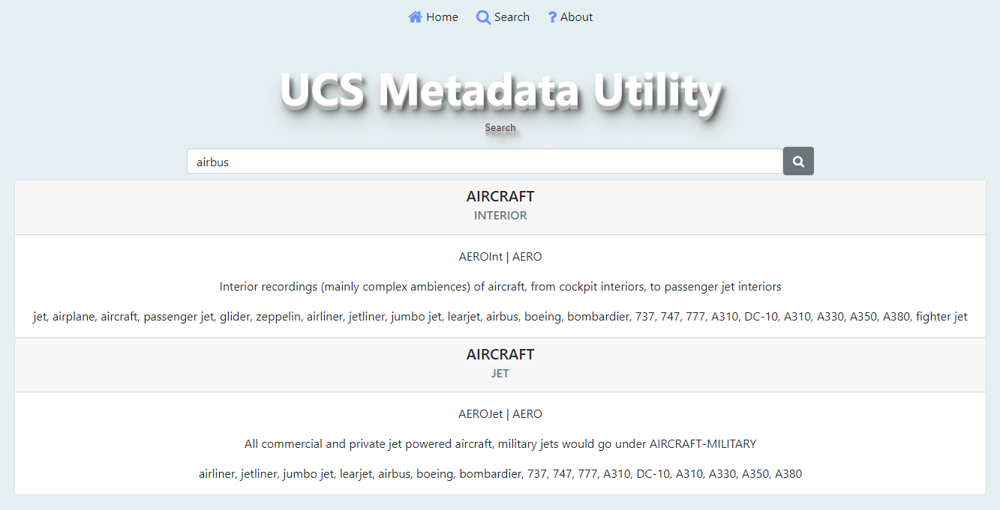

# What is UcsMetadataUtility?

<a target="_blank" href="https://www.paypal.com/paypalme/jorserp">&nbsp;Pay me a coffee if find this tool useful</a>

> This is a multiplatform Web Tool to create medatada following the UCS - Universal Category System proposals

**UCS** is a public domain initiative to provide the use of a set category list for the classification of sound effects

You can find more information about *UCS* clicking in the next image link

<a target="_blank" href="https://universalcategorysystem.com/"></a>

### Videos
* <a href="https://www.youtube.com/watch?v=0s3ioIbNXSM">YouTube - UCS Filename Structure</a>
* <a href="https://www.youtube.com/watch?v=5WRlLx-yDOI">YouTube - How to write metadata for field recording & sound effects - Universal Category System (UCS)</a>

# How it works
* Load dinamically a CSV file named <em>UCSCategoryList.csv</em> with the UCS official content. You can edit the file deleting or adding content there if is fine for you
* Has three sections (<strong>Home</strong>, <strong>Search</strong> and <strong>About</strong>)
* <strong>Home</strong> is the heart of this tool, and you can use it to create your metadata information. You can copy the sections of UCS to paste them in the metadata parts, to delete, edit or add information quickly. Finally, you can set the extension file (<em>WAV</em>, <em>MP3</em> or <em>AIIF</em>), and copy to the clipboard the result to paste it as metadata
* <strong>Search</strong>, lets you localize a term, its categorization and the details that contains
* <strong>About</strong>, is a little help information that contains something very similar to this README file

# Software Requirements
* This tool is developed using .NET Core 6, so you will have to install **ASP.NET Core Runtime 6.0.x** for your OS. You can find the package <a href="https://dotnet.microsoft.com/en-us/download/dotnet/6.0">here</a>
* After this, you can run this tool with the command **dotnet UcsMetadataUtility.dll**, but you can do it easily with the batch files that I am sharing in the **Executing the tool** section in this document

# Fixing errors executing the tool
* If executing the command you find the error `Unhandled exception. System.IO.IOException: Failed to bind to address http://127.0.0.1:5000: address already in use.`, use a different port executing the command *dotnet UcsMetadataUtility.dll --urls=http://localhost:port* where *port* is a different default port (5000), as for example **dotnet UcsMetadataUtility.dll --urls=http://localhost:5004** 

> If you consider execute this tool in a https port, you can do it too

# Download the Tool
* You can download the tool from this <a href="https://github.com/J0rgeSerran0/UcsMetadataUtility/releases/tag/v1.0.0">link</a>
* Note: If you not find confident with this link, you can download the source code and compile it on your machine. Feel free to do it as you want

# Executing the tool
* To help you, I have prepared some scripts to execute the tool easily on your System. These scripts are for *Windows* and *macOS* only. I have not prepared the *Linux* batch file, but is very similar

## Windows
* Create a **.bat** file and add the next content

```yaml
cd C:\UcsMetadataUtility\
start http://localhost:5000/
dotnet UcsMetadataUtility.dll 
```

> Note: change the path, or the port, as is explained in this document

## macOS
* Create a **.sh** file and add the next content

```yaml
#!/bin/bash
cd /UcsMetadataUtility/
open "http://localhost:5004/" 
dotnet UcsMetadataUtility.dll --urls=http://localhost:5004
```

> Note: change the path, or the port, as is explained in this document

# Screens (v1.0)

## Home Screen


## Search Screen

